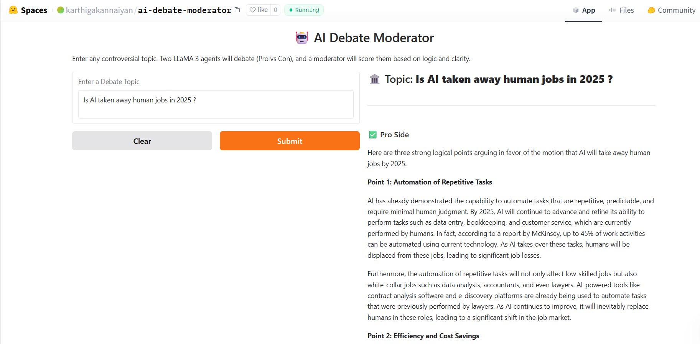

# 🤖 AI Debate Moderator

Welcome to the **AI Debate Moderator** — a multi-agent LLM system that hosts Oxford-style debates between two AI agents (Pro vs Con), and scores them for logic and clarity using a third AI moderator.

---

## 🧠 What It Does

- Accepts **any controversial topic** entered by the user
- Uses **LLaMA 3 models** (via the Groq API) to simulate a structured debate:
  - **Pro agent** argues *in favor* of the topic
  - **Con agent** argues *against* the topic
  - **Moderator agent** scores both sides based on reasoning, evidence, and clarity

---

## 🚀 Live Demo

👉 [Try it on Hugging Face Spaces]
https://huggingface.co/spaces/karthigakannaiyan/ai-debate-moderator

---

## 🎯 Features

- 🧠 **Multi-agent AI architecture** (Pro vs Con vs Moderator)
- 📜 **Structured long-form arguments**
- ⚖️ **Logic-based verdict with scoring**
- 💬 **Free input**: Users can type *any* topic, not just pre-defined ones
- 🌐 **Runs entirely via Groq API using open-source LLaMA 3 models**
- 🗣️ Optional voice output using `gTTS` + `playsound` (local only)

---

## 📦 Tech Stack

| Tool         | Purpose                          |
|--------------|----------------------------------|
| Python       | Core backend                     |
| Gradio       | Frontend UI                      |
| Groq API     | LLaMA 3 (70B) API access         |
| gTTS         | Text-to-speech (optional)        |
| playsound    | Local voice playback (optional)  |
| Hugging Face | Deployment & hosting             |

---

## 🛠️ How to Run Locally

```bash
# Clone the project
git clone https://huggingface.co/spaces/karthigakannaiyan/ai-debate-moderator
cd ai-debate-moderator

# (Optional) Create a virtual environment
python -m venv venv
source venv/bin/activate  # or venv\Scripts\activate on Windows

# Install dependencies
pip install -r requirements.txt

# Add your Groq API key to a .env file
echo "GROQ_API_KEY=your_api_key_here" > .env

# Run the app
python app.py

## 🖼️ Demo Screenshot

This is how the app looks when a debate is generated:




Sample Debate
Topic: Is AI taking away human jobs?

<details> <summary><strong>Click to view full debate</strong></summary>
✅ Pro Argument
AI automates repetitive tasks, reducing need for human labor

Displacement of workers in industries like manufacturing, finance, and transport

Limited job creation in AI sectors due to skill mismatch

❌ Con Argument
AI creates new jobs in machine learning, virtual assistants, and robotics

Enhances human productivity, not full replacement

Cannot replicate human creativity, empathy, or contextual understanding

⚖️ Moderator Verdict
Pro Score: 8.5

Con Score: 9.5

🔍 The Con side presented more nuanced reasoning and stronger evidence. Therefore, the moderator favors the Con position.

</details>
📄 License
This project is licensed under the MIT License.
Feel free to use, modify, and extend it for research or educational purposes.

👩‍🎓 Created By
K. Karthiga Alias Amali
Final Year MSc Data Science
 A capstone project demonstrating multi-agent LLM coordination, debate scoring, and ethical AI reasoning.

🌟 Acknowledgements
Groq API – blazing-fast LLaMA 3 inference

LLaMA 3 (Meta) – open-weight LLMs

Gradio – UI toolkit for ML demos